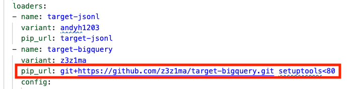

# DSAI - HDB Resale Price End to End Pipeline Setup - Dagster

## HDB Resale Data Setup

Please refer to the following [document](supabase_db_setup_hdb.md) for HDB Resale data setup.

Alternatively, you can connect to the following setup:

```yaml
host: aws-1-ap-northeast-2.pooler.supabase.com
port: 5432
database: postgres
user: postgres.hdsstnshkjzcccdaxlsb
pool_mode: session
```

Table name is `hdb_resale_flat_prices_e2e`


## HDB Resale Price End to End Pipeline - Setup Meltano

### Add an Extractor to Pull Data from Postgres (Supabase)

We will use the `tap-postgres` extractor to pull data from a Postgres database hosted on [Supabase](https://supabase.com). 

We're going to add an extractor for Postgres to get our data. An extractor is responsible for pulling data out of any data source. We will use the `tap-postgress` extractor to pull data from the Supabase server. 

At the root folder, create a new Meltano project by running:

```bash
meltano init meltano_hdb_resale
```
```bash
cd meltano_hdb_resale
```

Set Python 3.11 for all plugins to be inline with environment.

```bash
meltano config set meltano python python3.11
```

To add the extractor to our project, run:

```bash
meltano add tap-postgres
```

Next, configure the extractor by running:

```bash
meltano config set tap-postgres --interactive
```

Configure the following options:

- `database`: `postgres`
- `filter_schemas`: `['public']`
- `host`: `aws-0-ap-southeast-1.pooler.supabase.com` *(example)*
- `password`: *database password*
- `port` : `5432`
- `user`: *postgres.username*

Add the following to the meltano.yml file:


Test your configuration:
```bash
meltano config test tap-postgres
```
Use the following command to list all
```bash
meltano select tap-postgres --list --all
```

Next, we need to select the table that we need:
```bash
meltano select tap-postgres "public-hdb_resale_flat_prices_e2e"
```

Use the following command to check what we selected
```bash
meltano select tap-postgres --list
```

### Set Incremental Update
Next, we need to set the replication to `Incremental` on the primary key:

```bash
meltano config set tap-postgres _metadata "public-hdb_resale_flat_prices_e2e" replication-method INCREMENTAL
```

```bash
meltano config set tap-postgres _metadata "public-hdb_resale_flat_prices_e2e" replication-key updated_at
````


### Add an Loader to Load Data to BigQuery
We will now add a loader to load the data into BigQuery.
```bash
meltano add target-bigquery
```

```bash
meltano config set target-bigquery --interactive
```

Set the following options:

- `batch_size`: `104857600`
- `credentials_path`: _full path to the service account key file_
- `dataset`: `postgres_hdb_resale_raw`
- `denormalized`: `true`
- `flattening_enabled`: `true`
- `flattening_max_depth`: `1`
- `location`: `US`
- `method`: `batch_job`
- `project`: *your_gcp_project_id*

### Temporary Work Around for Meltano Packaging Issue
On February 6, 2026, `setuptools` released version 81.0.0, which officially removed the module `pkg_resources` entirely which meltano depends on. The work around fix is as follows:
1. Open `meltano.yml` under the project folder `meltano-ingestion`.
2. Under `name: target-bigquery`, look for `pip_url: git+https://github.com/z3z1ma/target-bigquery.git`
3. Add `setuptools<80` with a space after git. The resulting setup as as follows:



### Setting Environment

Comment out the original
```yml
# environments:
# - name: dev
# - name: staging
# - name: prod
```

Add the following 

```yml
# Environment-specific overrides
environments:
  - name: dev
    config:
      plugins:
        loaders:
          - name: target-bigquery
            config:
              dataset: dev_postgres_hdb_resale_raw
              # Path to your dev/shared service account key
              # credentials_path: /path/to/your/dev-service-account.json -- keep for future

  - name: prod
    config:
      plugins:
        loaders:
          - name: target-bigquery
            config:
              dataset: prod_postgres_hdb_resale_raw
              # Path to your prod service account key
              # credentials_path: /path/to/your/dev-service-account.json -- keep for future
```

Checking
```bash
# Check configuration for dev
meltano --environment=dev config list target-bigquery

# Check configuration for prod
meltano --environment=prod config list target-bigquery 
```

### Run Supabase (Postgres) to BigQuery

We can now run the full ingestion (extract-load) pipeline from Supabase to BigQuery.

```bash
meltano --environment=dev run tap-postgres target-bigquery
```

You will see the logs printed out in your console. Once the pipeline is completed, you can check the data in BigQuery.

At Bigquery, we can run the following SQL to check the number of record according to timestamp

```sql
SELECT
  TIMESTAMP_BUCKET(updated_at, INTERVAL 20 MINUTE)
    AS updated_at_20_min_interval,
  COUNT(*) AS record_count
FROM
  `sctp-dsai-ds3f-ds5.dev_postgres_hdb_resale_raw.public_hdb_resale_flat_prices_e2e`
GROUP BY 1
ORDER BY 1;
```
For per minute, use the following:
```sql
SELECT
  TIMESTAMP_TRUNC(updated_at, MINUTE) AS updated_at_minute,
  COUNT(*) AS record_count
FROM
  `sctp-dsai-ds3f-ds5.dev_postgres_hdb_resale_raw.public_hdb_resale_flat_prices_e2e`
GROUP BY 1
ORDER BY 1;
```

### Manage Incremental State (Timestamp-Based)

Now that incremental replication is configured using `updated_at` as the replication key, Meltano tracks progress using timestamps instead of numeric IDs.

#### Inspect Current State

```bash
meltano --environment=dev state list
```

```bash
meltano --environment=dev state get dev:tap-postgres-to-target-bigquery
```

You should see something like:

```json
{
  "bookmarks": {
    "public-hdb_resale_flat_prices_e2e": {
      "replication_key": "updated_at",
      "replication_key_value": "2026-05-30T12:34:56"
    }
  }
}
```

---

#### Rewind (Re-sync Recent Data)

If you suspect missing or corrupted data, you can rewind the pipeline by setting the timestamp to an earlier point.

Example: Reprocess data from May 1, 2026

```bash
meltano --environment=dev state set dev:tap-postgres-to-target-bigquery \
  --value '{
    "bookmarks": {
      "public-hdb_resale_flat_prices_e2e": {
        "replication_key": "updated_at",
        "replication_key_value": "2026-05-01T00:00:00"
      }
    }
  }'
```

On the next run, Meltano will extract:

```sql
WHERE updated_at > '2026-05-01T00:00:00'
```

---

#### Reset (Full Refresh)

To completely reset the pipeline state:

```bash
meltano --environment=dev state clear dev:tap-postgres-to-target-bigquery
```

This removes all saved checkpoints, causing the next run to reprocess all data from the beginning.

---

### ⚠️ Important (Append-Only BigQuery Behavior)

Since your pipeline is **append-only (no upsert)**:

* Rewind → will re-ingest overlapping data → duplicates
* Reset → will reload ALL data → full duplication

#### Recommended Practice

* Use **rewind carefully** for small backfills
* Avoid full reset unless necessary
* Treat your BigQuery table as a **raw history table**
* Handle deduplication downstream (e.g., dbt or SQL views)

#### Example Deduplication Query

```sql
SELECT *
FROM (
  SELECT *,
         ROW_NUMBER() OVER (PARTITION BY id ORDER BY updated_at DESC) AS rn
  FROM raw_table
)
WHERE rn = 1
```

#### Summary

| Action  | Command       | Notes                                     |
| ------- | ------------- | ----------------------------------------- |
| Inspect | `state get`   | View current timestamp checkpoint         |
| Rewind  | `state set`   | Use ISO timestamp                         |
| Reset   | `state clear` | ⚠️ Causes full duplication in append mode |

---

This workflow ensures safe and controlled incremental ingestion using `updated_at`.


## HDB Resale Price End to End Orchestration Setup dbt

Let's create a Dbt project to transform the data in BigQuery. 

To create a new dbt project. (make sure you exited the meltano folder)

```bash
dbt init dbt_hdb_resale
```

Fill in the required config details. 
- use service account
- add your path of the json key file
- dataset: `hdb_resale`
- project: your GCP project ID

Please note that the profiles is located at the hidden folder .dbt of your home folder. The `profiles.yml` that is located in the home folder includes multiple projects. Alternatively, you can create a separate `profiles.yml` for each project.

To create separate profiles for each project, create a new file called `profiles.yml` under `resale_flat` folder. Then copy the following to `profiles.yml`. Remember to change your key file location and your project ID.
```yaml
dbt_hdb_resale:
  outputs:
    dev:
      dataset: dev_hdb_resale
      job_execution_timeout_seconds: 300
      job_retries: 1
      keyfile: *<your_service_key_path>*
      location: US
      method: service-account
      priority: interactive
      project: *<gcp-project-id>*
      threads: 2
      type: bigquery
    prod:
      dataset: prod_hdb_resale
      job_execution_timeout_seconds: 300
      job_retries: 5
      keyfile: *<your_service_key_path>*
      location: US
      method: service-account
      priority: interactive
      project: *<gcp-project-id>*
      threads: 3
      type: bigquery
  target: dev
```

Create a file `packages.yml` with the following:
```yml
packages:
  - package: dbt-labs/dbt_utils
    version: 1.1.0 # or latest version
```
### Create source and models

We can start to create the source and models in the dbt project.

> 1. In `dbt_project.yml`, set the following:
```yml
models:
  dbt_hdb_resale:
    staging:
      +schema: stg    # Models in /models/staging/ go to 'staging'
      +materialized: view
    marts:
      +schema: marts      # Models in /models/marts/ go to 'marts'
      +materialized: table
```

> 2. Under `/models`, create 2 folder `staging` and `marts`

> 3. Create a `stg_hdb_resale.sql` model (materialized table) which selects all columns from the source table, perform some type conversion and calculating `remain_lease`.

```sql
{{ config(materialized='view') }}

WITH raw_source AS (
    SELECT
        id,
        PARSE_DATE('%Y-%m', month) AS resale_month,
        town,
        flat_type,
        block,
        street_name,
        storey_range,
        CAST(floor_area_sqm AS FLOAT64) AS floor_area_sqm,
        flat_model,
        lease_commence_date,
        remaining_lease,
        -- Extract years, default to 0 if not found, multiply by 12
        COALESCE(CAST(REGEXP_EXTRACT(remaining_lease, r'(\d+) year') AS INT64), 0) * 12 +
        -- Extract months, default to 0 if not found
        COALESCE(CAST(REGEXP_EXTRACT(remaining_lease, r'(\d+) month') AS INT64), 0) 
        AS remaining_lease_months,
        CAST(resale_price AS FLOAT64) AS resale_price,
        -- Keep your timestamp column to identify the freshest record
        updated_at
    -- Changed to underscore to avoid BigQuery compilation bugs
    FROM {{ source('hdb_resale_source', 'public_hdb_resale_flat_prices_e2e') }}
),

deduplicated AS (
    SELECT 
        *,
        -- Assigns 1 to the most recent record per individual ID
        ROW_NUMBER() OVER (
            PARTITION BY id 
            ORDER BY updated_at DESC
        ) AS row_num
    FROM raw_source
)

SELECT
    id,
    resale_month,
    town,
    flat_type,
    block,
    street_name,
    storey_range,
    floor_area_sqm,
    flat_model,
    lease_commence_date,
    remaining_lease,
    remaining_lease_months,
    resale_price,
    resale_price / floor_area_sqm AS price_per_sqm
FROM deduplicated
-- Filters out any duplicate records pulled by your replication tool
WHERE row_num = 1

```

> 4. Under `/models/staging`, create  `stg_hdb_resale.yml` which contains the source and the schema.

```yml
version: 2

sources:
  - name: hdb_resale_source
    description: "Raw HDB resale data from Postgres source"
    schema: "{{ target.name }}_postgres_hdb_resale_raw"
    tables:
      - name: public_hdb_resale_flat_prices_e2e
        description: "Raw monthly HDB transaction records"

models:
  - name: stg_hdb_resale
    description: "Cleaned HDB resale data with standardized metrics."
    columns:
      - name: id
        tests:
          - unique
          - not_null

      - name: floor_area_sqm
        description: "The size of the flat in square meters."
        tests:
          - not_null
          # Ensures value is greater than 0
          - dbt_utils.expression_is_true:
              arguments:
                expression: "> 0"

      - name: resale_price
        description: "The total transaction price."
        tests:
          - not_null
          - dbt_utils.expression_is_true:
              arguments:
                expression: "> 0"

      - name: price_per_sqm
        description: "Calculated unit price."
        tests:
          - not_null
          - dbt_utils.expression_is_true:
              arguments:
                expression: "> 0"

      - name: storey_avg
        description: "The midpoint of the floor range (e.g., 06 TO 08 becomes 7)."

      - name: remaining_lease_months
        description: "Total remaining lease calculated as (Years * 12) + Months."
```

> 5. Under `/models/marts/`, create a `dim_prices_by_town_type_model.sql`, the model (materialized table) which selects the `town`, `flat_type` and `flat_model` columns from `prices`, group by them and calculate the average of `floor_area_sqm`, `resale_price` and `price_per_sqm`. Finally, sort by `town`, `flat_type` and `flat_model`.

```sql
{{ config(materialized='table') }}

SELECT
    town,
    flat_type,
    flat_model,
    AVG(floor_area_sqm) AS avg_floor_area_sqm,
    AVG(resale_price) AS avg_resale_price,
    AVG(price_per_sqm) AS avg_price_per_sqm
FROM {{ ref('stg_hdb_resale') }}
GROUP BY 1, 2, 3
ORDER BY 1, 2, 3
```

> 6. Under `/models/marts/`, create a `dim_prices_by_town_type_model.yml`, a schema with test.

```yml
version: 2

models:
  - name: dim_prices_by_town_type_model  # Ensure this matches your .sql filename
    description: "Aggregated HDB resale metrics grouped by town and flat characteristics."
    columns:
      - name: town
        description: "The HDB town name."
        tests:
          - not_null

      - name: avg_price_per_sqm
        description: "The mean price per square meter for this group."
        tests:
          - not_null
          - dbt_utils.expression_is_true:
              arguments:
                expression: "> 0"

      - name: avg_resale_price
        description: "The mean transaction price for this group."
        tests:
          - not_null
          - dbt_utils.expression_is_true:
              arguments:
                expression: "> 0"

      - name: flat_type
        description: "Type of flat (e.g., 3 ROOM, 4 ROOM, EXECUTVE)."
        tests:
          - not_null
```

### Run Dbt

Check dbt connection first

```bash
dbt debug
```

Optional: you can run `dbt clean` to clear any logs or run file in the dbt folders.

Run the following to install packages:
```bash
dbt deps
````

Run the dbt project to transform the data.

```bash
dbt run

# or

dbt run --full-refresh
```

You should see 2 new tables in the `resale_flat` dataset.

Tun the following to test:
```bash
dbt test
```

After testing is complete, run the following:
```bash
dbt build
```

### Generate Documents

Run the following to generate documents:
```bash
dbt docs generate
```

Run the following to review the automated documenation:
```bash
dbt docs serve
```

## Dagster Using dbt Integration

This is similar to lesson 2.7 Extra - Hands-on with Orchestration II, where we create a dbt-dagster integrated project and we add meltano as a subprocess.

Use the following command:

```bash
dagster-dbt project scaffold --project-name dagster_dbt_integration_hdb_resale --dbt-project-dir #full-path-to-the-resale-flat-dbt-project-directory
```

Next we would like to add meltano as subprocess and also modify the asset and definitions to handle `dev` and `prod` environment.

```python
# assets.py
import os
import subprocess
from dagster import AssetExecutionContext, asset, Config, EnvVar
from dagster_dbt import DbtCliResource, dbt_assets
from .project import dbt_hdb_resale_project

# --- 1. DEFINE THE CONFIG SCHEMA HERE ---
class PipelineConfig(Config):
    # This tells Dagster to look for "TARGET". 
    # If it's not found in the OS, it falls back to "dev".
    target_env: str = os.getenv("TARGET", "dev")

# --- 2. USE IT IN YOUR ASSETS ---

@asset(compute_kind="meltano")
def pipeline_meltano(config: PipelineConfig) -> None:
    # 1. Get the directory where THIS assets.py file lives
    current_dir = os.path.dirname(os.path.abspath(__file__))
    
    # 2. Go up to the project root and then into the meltano folder
    # This assumes meltano_hdb_resale is one level up from assets.py
    cwd = os.path.abspath(os.path.join(current_dir, "..", "..", "meltano_hdb_resale"))
    
    # Debugging: This will show up in Dagster logs so you can see where it's looking
    print(f"Looking for Meltano in: {cwd}")

    cmd = ["meltano", "--environment", config.target_env, "run", "tap-postgres", "target-bigquery"]
    
    try:
        # Check if the directory actually exists before running
        if not os.path.exists(cwd):
            raise FileNotFoundError(f"Could not find Meltano directory at {cwd}")
            
        output = subprocess.check_output(cmd, cwd=cwd, stderr=subprocess.STDOUT).decode()
    except subprocess.CalledProcessError as e:
        raise Exception(e.output.decode())

@dbt_assets(manifest=dbt_hdb_resale_project.manifest_path)
def dbt_hdb_resale_dbt_assets(
    context: AssetExecutionContext, 
    dbt: DbtCliResource, 
    config: PipelineConfig # Injecting the config here too
):
    # Pass the value to dbt --target
    yield from dbt.cli(["build", "--target", config.target_env], context=context).stream()
```

We also need to modified `definitions.py`:

```python
from dagster import Definitions
from dagster_dbt import DbtCliResource
from .assets import dbt_hdb_resale_dbt_assets, pipeline_meltano
from .project import dbt_hdb_resale_project
from .schedules import schedules

defs = Definitions(
    assets=[pipeline_meltano, dbt_hdb_resale_dbt_assets],
    schedules=schedules,
    resources={
        "dbt": DbtCliResource(project_dir=dbt_hdb_resale_project),
    },
)
```
We also need to modify the dependency of dbt at `stg_hdb_resale.yml` under `source` section as follows:

```yml
sources:
  - name: hdb_resale_source
    description: "Raw HDB resale data from Postgres source"
    schema: "{{ target.name }}_postgres_hdb_resale_raw"
    meta:
      dagster:
        asset_key: ["pipeline_meltano"]
    tables:
      - name: public_hdb_resale_flat_prices_e2e
        description: "Raw monthly HDB transaction records"
```

