# Setup HDB Resale Data into Supabase

## Account Creation
- Create a free account if you have not already done so.
- First, enter a project name
- Next, enter a database password, please copy the password and place it some where safe. Click `Create new project` when done.

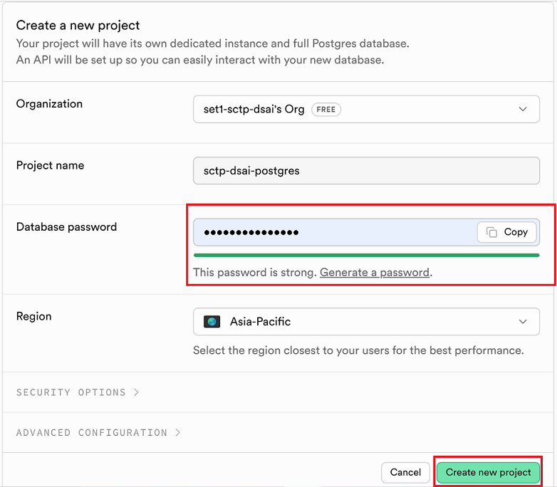


## Preparing Data File
- you can use the old data file from lesson 2.6 [data folder](https://github.com/thomastay353/5m-data-2.6-data-pipelines-orchestration/tree/main/data) 
- File name is `ResaleflatpricesbasedonregistrationdatefromJan2017onwards.csv`
- Alternatively you can get data from [https://data.gov.sg/](https://data.gov.sg/) at
- https://data.gov.sg/datasets?query=HDB+resale&resultId=d_8b84c4ee58e3cfc0ece0d773c8ca6abc

### Split Data File
- Next, we need to split the data file into multiple parts to simulate data ingestion in multiple time frame.
- Use the python script `/data/split_data.py` by opening the terminal.
- Run the following command:

```bash
cd data
```

```bash
python split_data.py
```

Under the data folder we should have a subfolder with multiple file split.

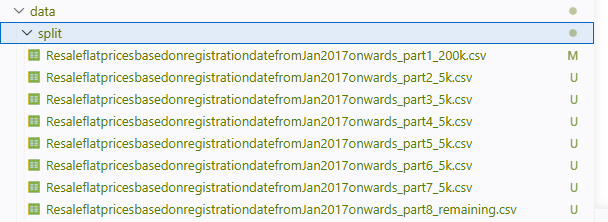

## Create and Setup Table

### Setup the table
Go to **SQL Editor**

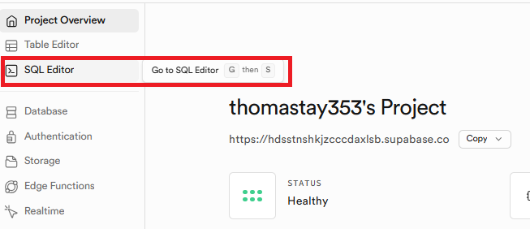

Paste the following code into one of the new query:

```sql
-- 1. Completely drop the table (this removes all old rules/triggers automatically)
DROP TABLE IF EXISTS hdb_resale_flat_prices_e2e;

-- 2. Recreate the table schema
CREATE TABLE hdb_resale_flat_prices_e2e (
    id BIGINT PRIMARY KEY,
    -- Add your actual HDB columns here, for example:
    month TEXT,
    town TEXT,
    flat_type TEXT,
    block TEXT,
    street_name TEXT,
    storey_range TEXT,
    floor_area_sqm TEXT,
    flat_model TEXT,
    lease_commence_date INT,
    remaining_lease TEXT,
    resale_price TEXT,
    -- Keep your core tracking columns with default values
    created_at TIMESTAMP WITH TIME ZONE DEFAULT clock_timestamp(),
    updated_at TIMESTAMP WITH TIME ZONE DEFAULT clock_timestamp()
);
```
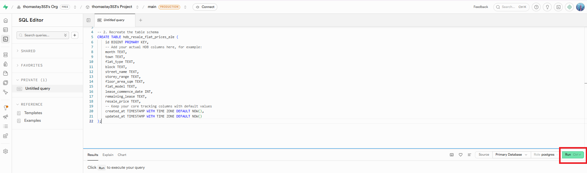

Click **Run**

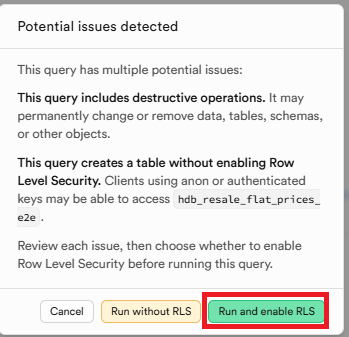

Click  **Run and Enable RLS**

### Setup Trigger to Update Timestamp

Paste the following to create trigger function to update timestamp:
```sql
-- 1. Create or update the smart trigger function
CREATE OR REPLACE FUNCTION strict_timestamp_tracker()
RETURNS TRIGGER AS $$
BEGIN
    IF (TG_OP = 'INSERT') THEN
        IF NEW.created_at IS NULL THEN NEW.created_at = clock_timestamp(); END IF;
        IF NEW.updated_at IS NULL THEN NEW.updated_at = clock_timestamp(); END IF;
        
    ELSIF (TG_OP = 'UPDATE') THEN
        -- Allow backfills during rule processing if created_at starts as NULL
        IF OLD.created_at IS NOT NULL THEN
            NEW.created_at = OLD.created_at;
        END IF;
        NEW.updated_at = clock_timestamp();
    END IF;
    
    RETURN NEW;
END;
$$ LANGUAGE plpgsql;

-- 2. Attach the trigger to the fresh table
CREATE TRIGGER enforce_strict_timestamps
BEFORE INSERT OR UPDATE ON hdb_resale_flat_prices_e2e
FOR EACH ROW
EXECUTE FUNCTION strict_timestamp_tracker();

-- 3. Attach the UI rewrite rule to handle dashboard imports
CREATE OR REPLACE RULE handle_supabase_ui_csv_inserts AS
ON INSERT TO hdb_resale_flat_prices_e2e
DO ALSO (
    UPDATE hdb_resale_flat_prices_e2e
    SET 
        created_at = COALESCE(created_at, clock_timestamp()),
        updated_at = COALESCE(updated_at, clock_timestamp())
    WHERE id = NEW.id 
      AND (created_at IS NULL OR updated_at IS NULL)
);
```

> **We only need to run this trigger once.**

## Importing CSV to Supabase
- Go to **Table Editor**

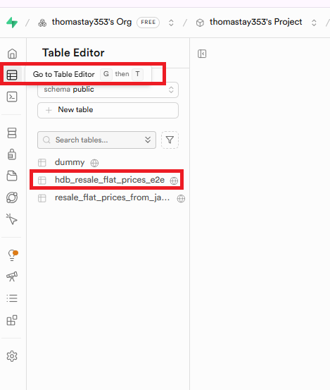

- Select the table `hdb_resale_flat_prices_e2e`

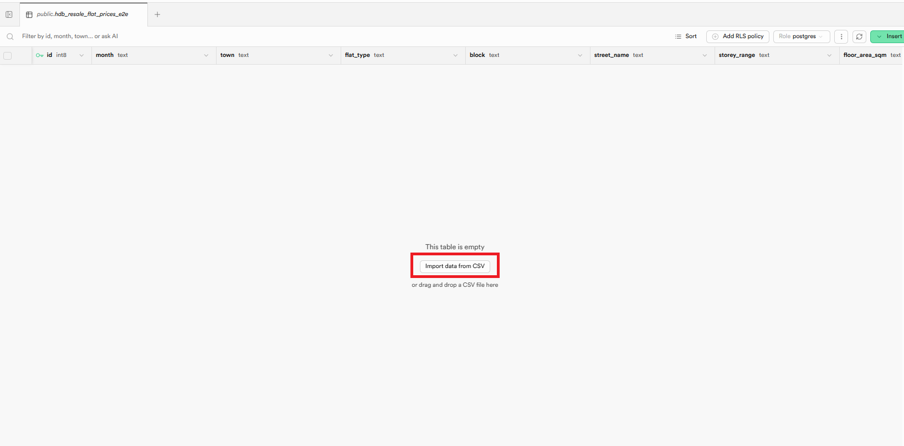

- Click **Import CSV**

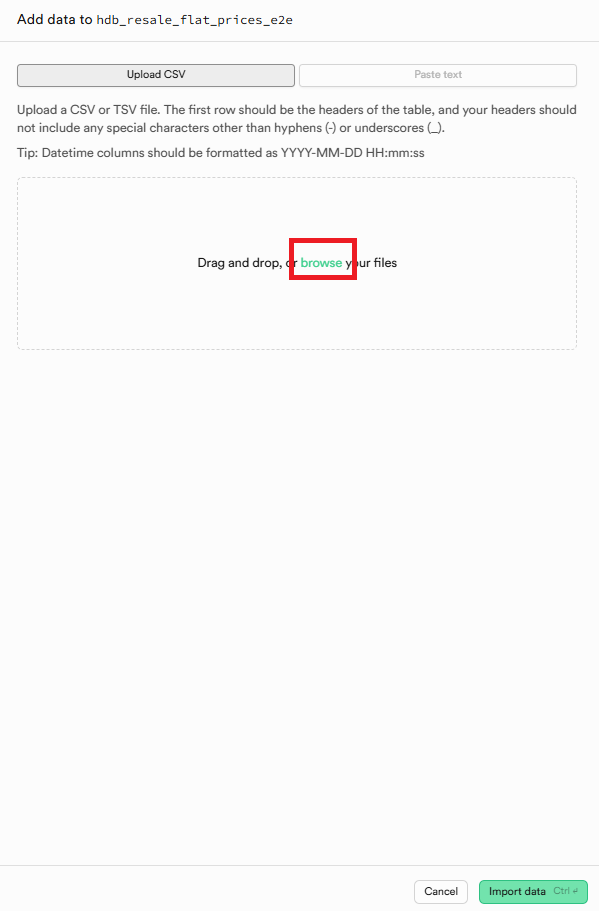

- Click **Browse** (some classmate got issue with drag and drop)

- Select the **first split data file (200k)** in the split folder or the subsequent batch if you already done the first batch.

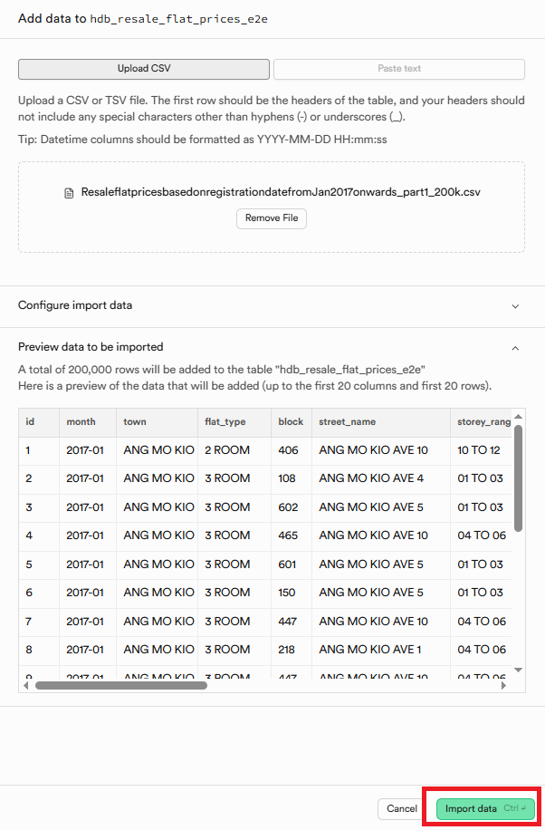

- Click **Import** to import:

- You should see the import progress as shown below, this will take a while:

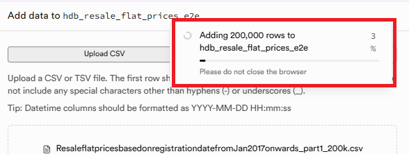

> Please repeat the above import for subsequent batch


## Connection with Supabase
To get the connection setting from Supabase, please follow the steps below:

- Click connect
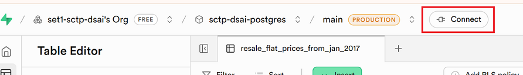

- Change connection method from `Direct connection` and to `Session pooler`
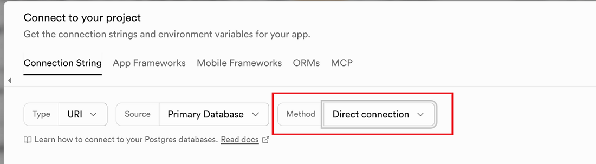
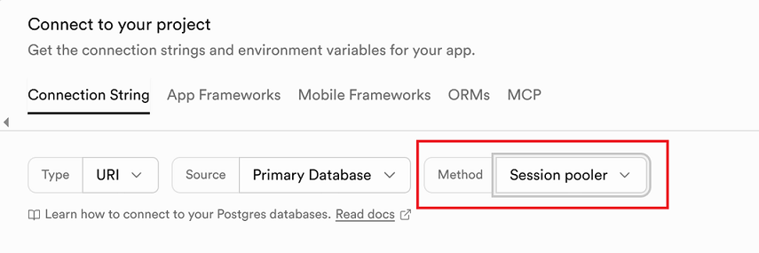

### Connection Type
- For connection type, we use the default `URI` , the setting should be similar across different type. 
- If you want to test your connection in Python, you can select `Python` or `SQLAlchemy`
- If you select Python or SQL Alchemy, additional Python code will be provided for us to test the connection. 

### Connection Method 
- This is related to your specific ISP. In Singapore, we stick to `Session pooler`. This is for ISP who uses IPv4.
- If you encounter error with `Session pooler`, and you know that your ISP uses only IPv6, then you can try `Direct connection`.

### Get Connection Parameters - Session pooler
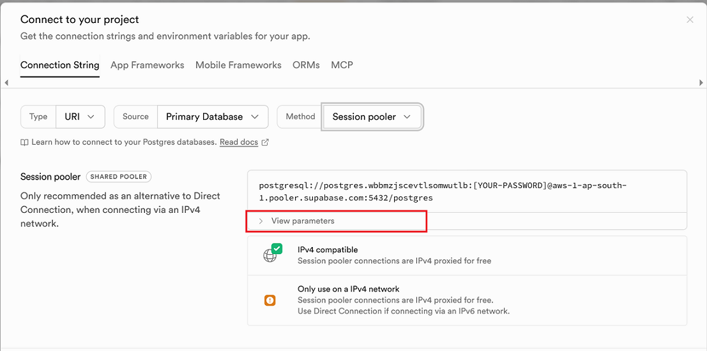
- Click `View parameters`
- The settings that is related to your database will be presented to you.

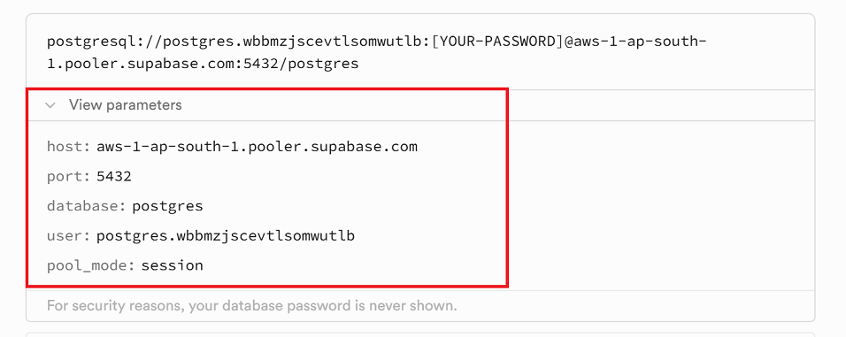
- **Take note of the parameters as we need it to configure Meltano. Please note that we also need to have the db password we created on the first step.**

### Testing Connection
If you encounter connection issues with Meltano, you can try choosing Python or SQLAlchemy. Next to the connection string, the code to test the connection is provided.

### Possible Connection Error
Supabase, uses IPV6 for direct connection, so the problem may depend on your ISP. Anyway, the following warning is shown:
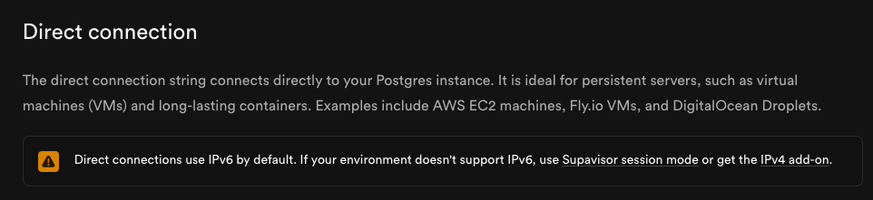

- Try `Session pooler` first and if error try `Direct connection`.

Reference link: https://supabase.com/docs/guides/database/connecting-to-postgres
